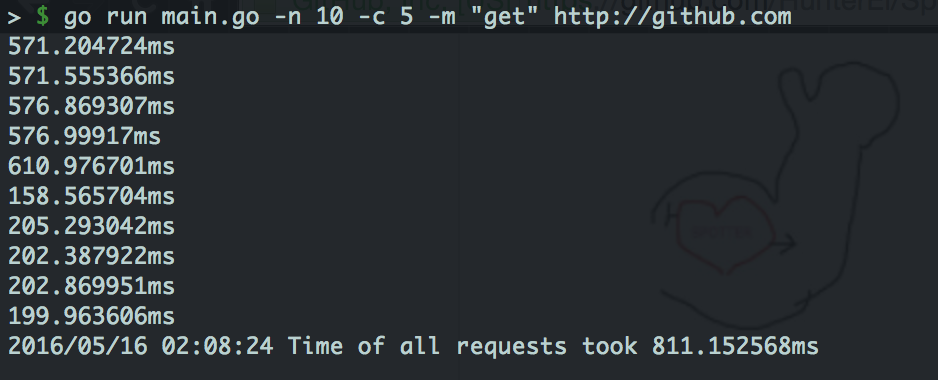

# Spotter 

Here to help you bench.

##What exactly does it do?
Spotter will be a command-line tool to help you benchmark your web servers. 

Morally distinct from another existing tool... 

##What it currently does:

##Planned flags:
- -n: Request Number
- -r: Request Type
- -h: Request Header
- -c: Concurrency Level

##How is it different than AB?
Well, it currently isn't. BUT! there are shortcomings I have noticed with AB I will try and fix. As well as some other goodies. Stay tuned.
